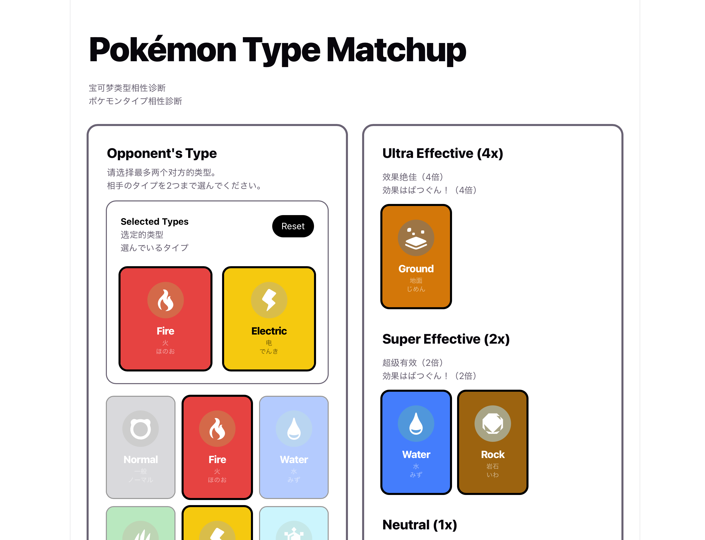

# [Pokémon Type Matchup](https://pokemon-type-matchup-one.vercel.app)

Pokémon Type Matchup is an app to instantly find the most effective attack types against your opponent.

## Features

- Supports single and dual-type matchups
- Displays effectiveness:
  - 4x (Ultra Effective)
  - 2x (Super Effective)
  - 1x (Neutral)
  - 0.5x / 0.25x / 0x
- Smooth animations for selected types
- Multi-language support (EN/CN/JP)

## Tech Stack

- React
- TypeScript
- Vite
- Tailwind CSS
- Motion

## Credits

- Pokémon type icons by [partywhale](https://github.com/partywhale/pokemon-type-icons)

## License

[MIT](https://choosealicense.com/licenses/mit/)
